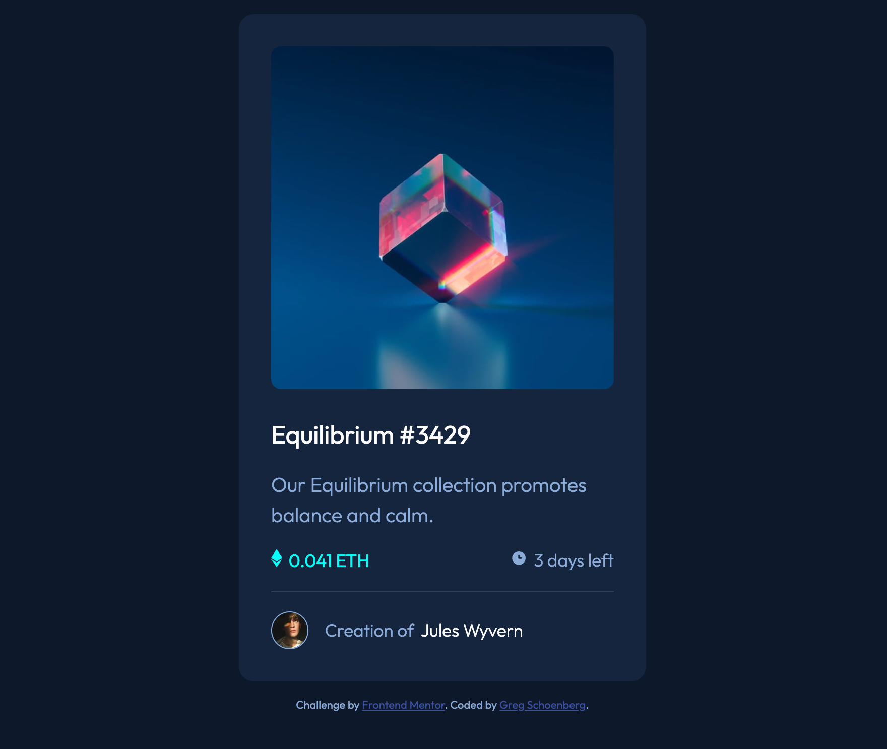

# Frontend Mentor - NFT preview card component solution

This is a solution to the [NFT preview card component challenge on Frontend Mentor](https://www.frontendmentor.io/challenges/nft-preview-card-component-SbdUL_w0U). Frontend Mentor challenges help you improve your coding skills by building realistic projects.

## Table of contents

- [Overview](#overview)
  - [The challenge](#the-challenge)
  - [Screenshot](#screenshot)
  - [Links](#links)
- [My process](#my-process)
  - [Built with](#built-with)
- [Author](#author)

## Overview

### The challenge

Users should be able to:

- View the optimal layout depending on their device's screen size
- See hover states for interactive elements

### Screenshot

### Links

- Solution URL: (https://github.com/GregNicholas/FE-mentor-quick-challenge-NFT)
- Live Site URL: (https://gregnicholas.github.io/FE-mentor-quick-challenge-NFT/)

## My process

### Built with

- Semantic HTML5 markup
- CSS custom properties
- Flexbox

### What I learned

Just wanted to complete a quick frontendmentor.io challenge, and do a html/css card with some hover states.

### Continued development

Nothing for this, but I like to have things like this on hand for future reference.

## Author

- Website - [Add your name here](https://gregschoenberg.com)
- Frontend Mentor - [@yourusername](https://www.frontendmentor.io/profile/GregNicholas)
